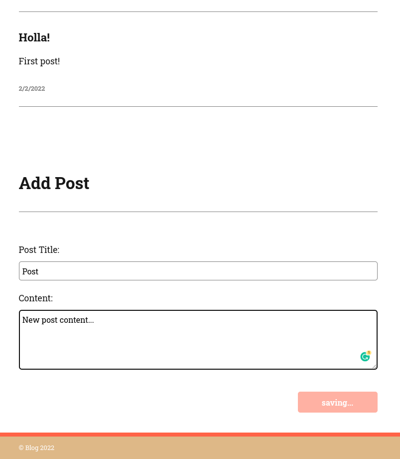
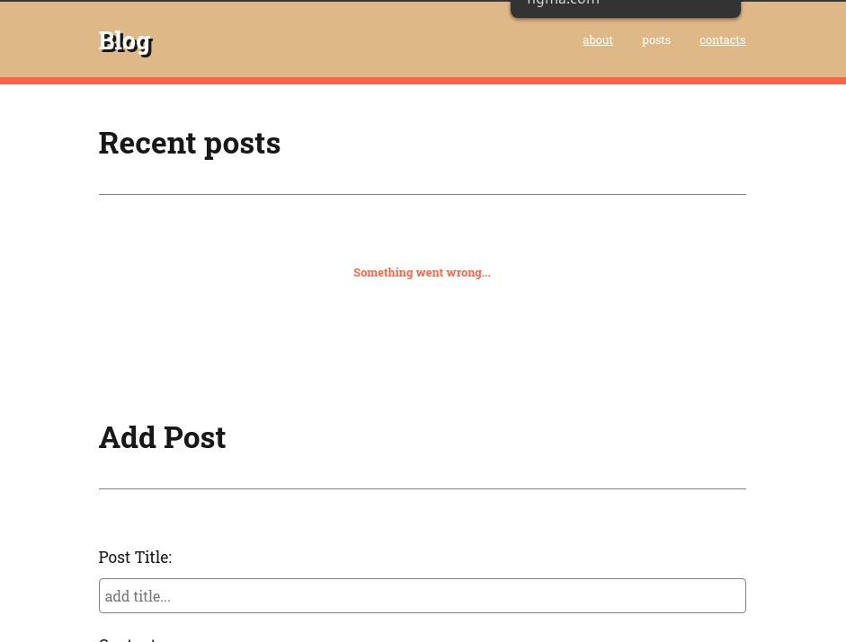
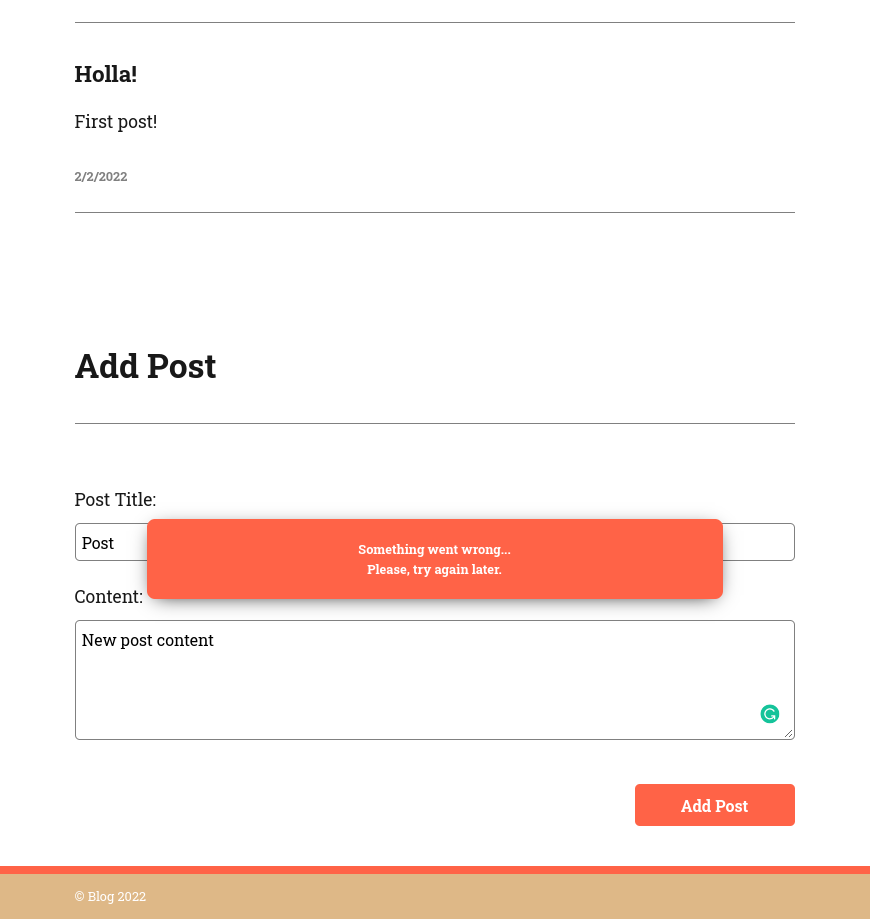

# Задание

## 1. Отображение меню

Необходимо реализовать открытие/скрытие главного меню по нажатию на кнопку "Бургера"

## 2. Получение и отображения списка постов

Получить список постов, и отобразить на странице в соответствии с макетом.

_Обратите внимание, что во время загрузки данных на странице отображается "Лоадер"._

_После того как данные успешно загружены, "Лоадер" скрывается, а на его месте отображается список постов._

_Посты отображаются в порядке от самого нового к старому (Самый новый в начале!)_

### API

URL: https://api.github.com/users

[Документация](https://github.com/papatomatoe/api-web-blog-doc)

### Подсказка по стилям

1. Список постов `.posts__list`
2. Пост `.posts__item`
3. Заголовок поста `.posts__title`
4. Контент поста `.posts__content`
5. Дата `posts__date`

### Пример разметки

## 3. Создание поста

Необходимо добавить сохранение одного поста на сайт с помощью формы "Add Post".

_По умолчанию кнопка "Add Post" не активна._

_При введение значений в поля "Post Title" и "Content", кнопка становится активной._

_После отправки данных форма очищается._

_Новый пост отображается в начале страницы._

## 4. Создание поста (дополнение)

Во время сохранения поста сделать кнопку неактивной, текст **Add Post** должен меняться на **Saving...**

## 5. Обработка ошибок.

В случае если возникает ошибка при получении постов необходимо показать сообщение об ошибке на странице.

В случае если возникает ошибка при создании нового поста отобразить ошибку в форме на 3 секунды, затем скрыть. при этом поля в форме не должны очищаться.

_Для отображения ошибки в форме необходимо добавить класс `.add-post__error--active` соответствующему элементу_
